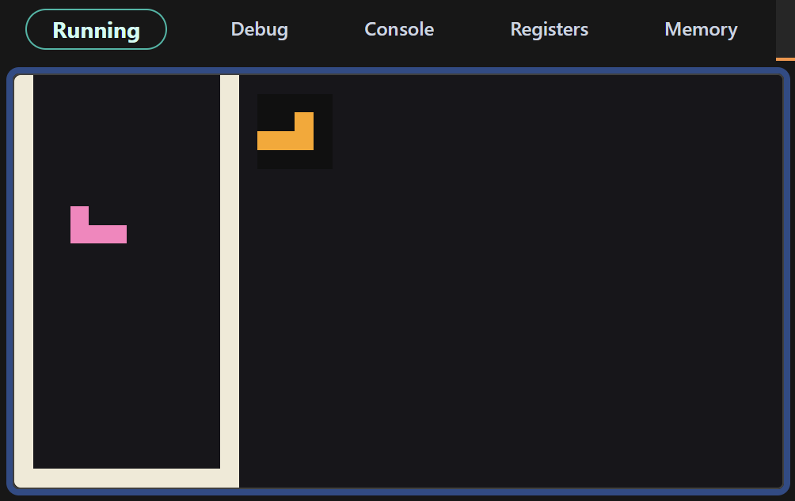
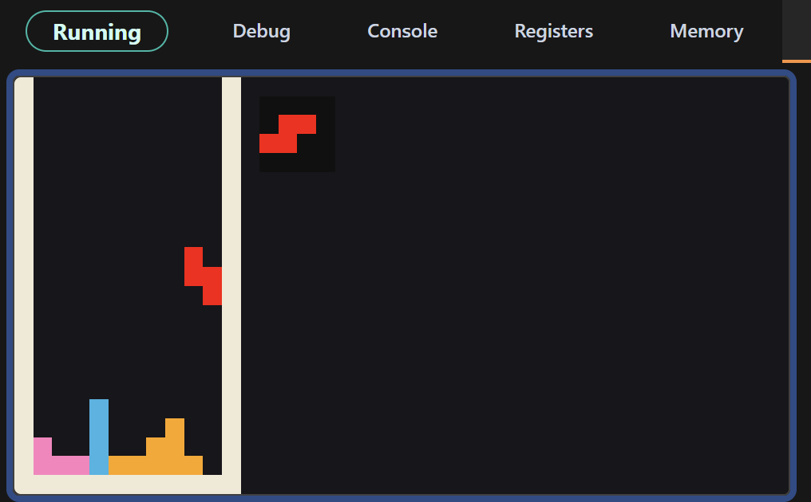
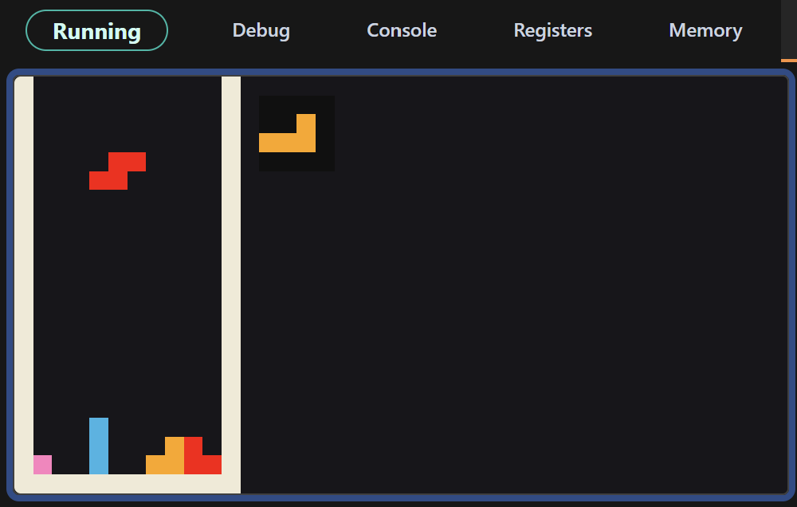
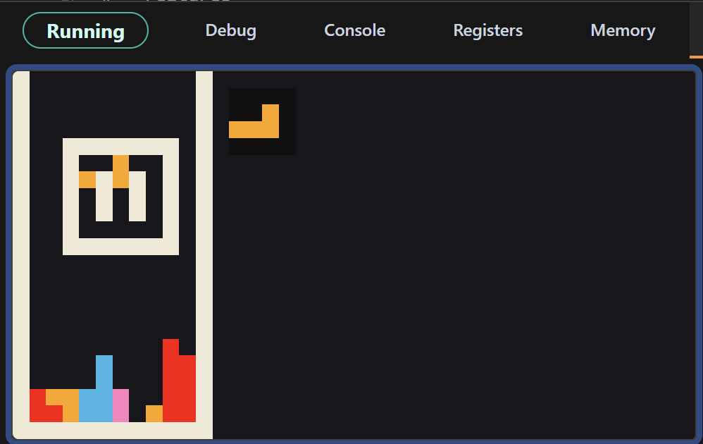
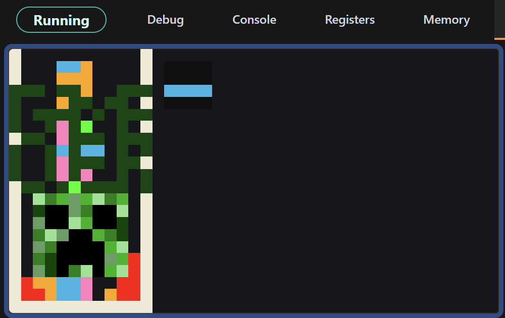

# Assembly-Tetris
Arcade Tetris clone for RISC (Reduced Instruction Set Computer) systems using MIPS Assembly.

- Starting up the game.

- Placing some blocks...

- Tetris!

- Paused.

- Game Over :(
